# TaskBridge

Die **TaskBridge** ist eine Webanwendung für verteilte Aufgabenverarbeitung. **Clients** können Aufgaben registrieren, die anschließend von **Workern** verarbeitet werden.

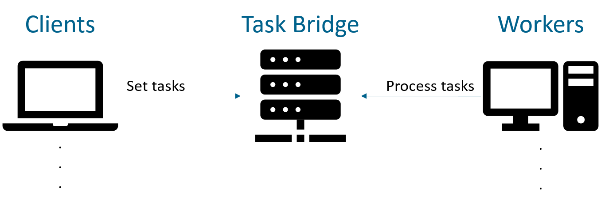

Nachdem ein Worker eine Aufgabe abgearbeitet hat, berichtet dieser die Ergebnisse an die TaskBridge, wo sich anschließend der auftraggebende Client das Ergebnis abholen kann.

Es wird derzeit kein HTTPS unterstützt, da die existierenden Worker mit den selbst signierten Zertifikaten nicht klar kommen.

## Docker Image starten

```sh
# Aufgaben und Statistiken auf Festplatte unter ./data/tasks.json speichern, diese bleiben über einen Neustart hinweg erhalten
docker run --name taskbridge-ondisk -e PORT=3000 -e PERSISTENCE=ONDISK -p 42000:3000 hilderonny2024/taskbridge:2.1.0

# Aufgaben und Statistiken nur im Speicher halten, erhöhte Performance durch fehlende Festplattenzugriffe
docker run --name taskbridge-inmemory -e PORT=3000 -e PERSISTENCE=INMEMORY -p 42000:3000 hilderonny2024/taskbridge:2.1.0
```

Die TaskBridge (sowohl Weboberfläche als auch API ist anschließend am Port `42000` erreichbar.

## Als Hintergrunddienst auf Linux-Rechner laufen lassen

- Datei `/etc/systemd/system/taskbridge.service` mit folgendem Inhalt erstellen

```
[Unit]
Description=taskbridge

[Service]
ExecStart=/usr/bin/go /github/hilderonny/taskbridge/main.go
WorkingDirectory=/github/hilderonny/taskbridge
Restart=always
RestartSec=10
StandardOutput=syslog
StandardError=syslog
SyslogIdentifier=taskbridge
Environment="PORT=42000"
Environment="PERSISTENCE=ONDISK"
[Install]
WantedBy=multi-user.target
```

- Hintergrunddienst registrieren und starten

```sh
sudo systemctl enable taskbridge
sudo systemctl start taskbridge
```

## Weboberfläche

Die TaskBridge bringt eine Weboberfläche mit, welche Standardaufgaben erstellen und die Verarbeitung überwachen lässt.

### Aufgabenübersicht

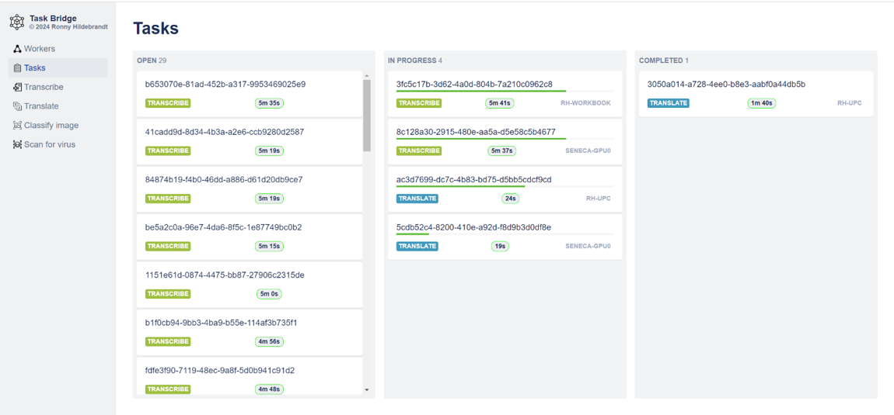

### Mediendateien transkribieren

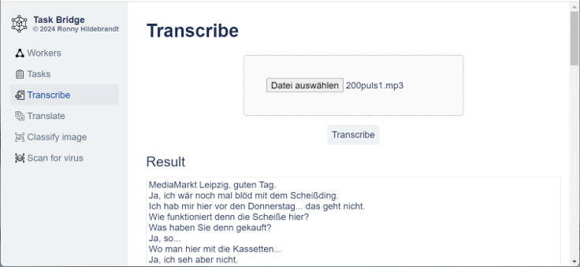

### Texte übersetzen

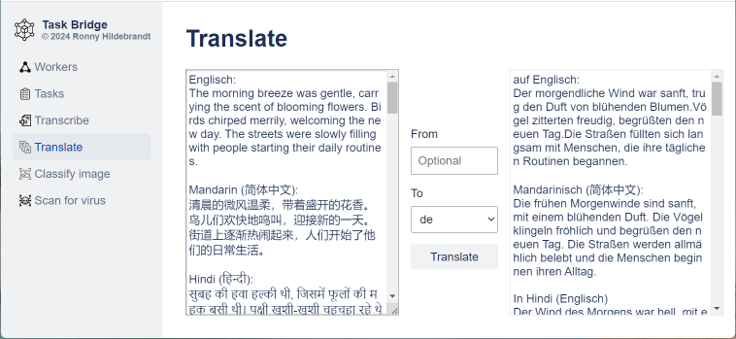

### Bilder nach [Synsets retained from ILSVRC2011](https://image-net.org/challenges/LSVRC/2012/browse-synsets) klassifizieren

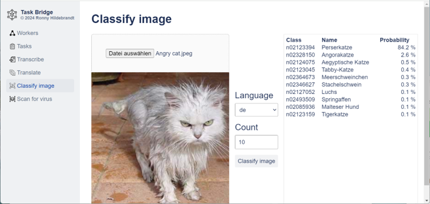

### Dateien mit [ClamAV](https://www.clamav.net/) nach Viren untersuchen

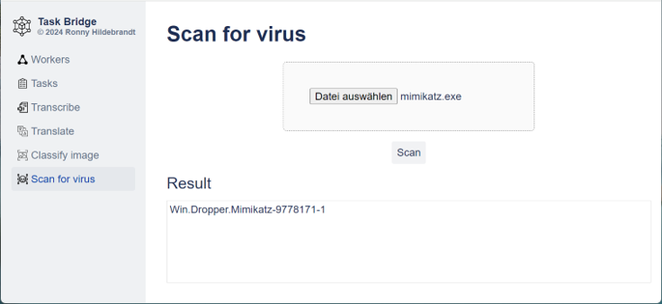

### Texte in Form eines ChatBots analysieren

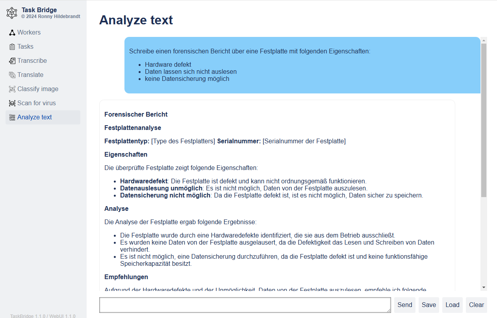

### Übersicht aller aktiven Worker

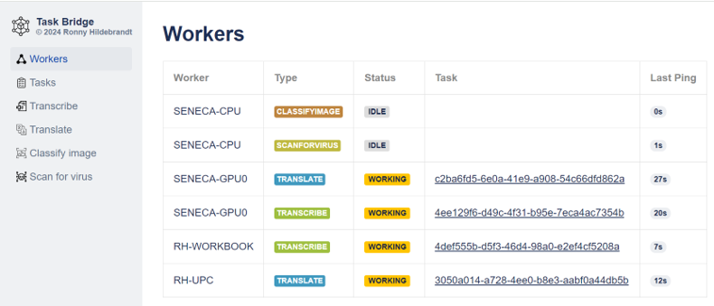

## Clients

Derzeit existieren verschiedene Clients als eigenständige Anwendungen oder als Plugins für andere Applikationen, die mit der **TaskBridge** kompatibel sind.

- Python Task für [IPED](https://github.com/sepinf-inc/IPED)

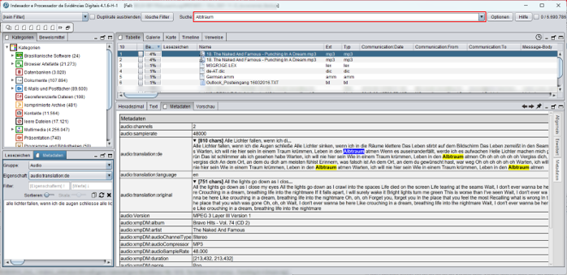

- Ruby plugin für [NUIX](https://www.nuix.com/)

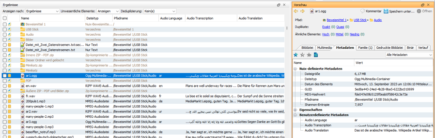

- X-Tension für [X-Ways](https://www.x-ways.net/)

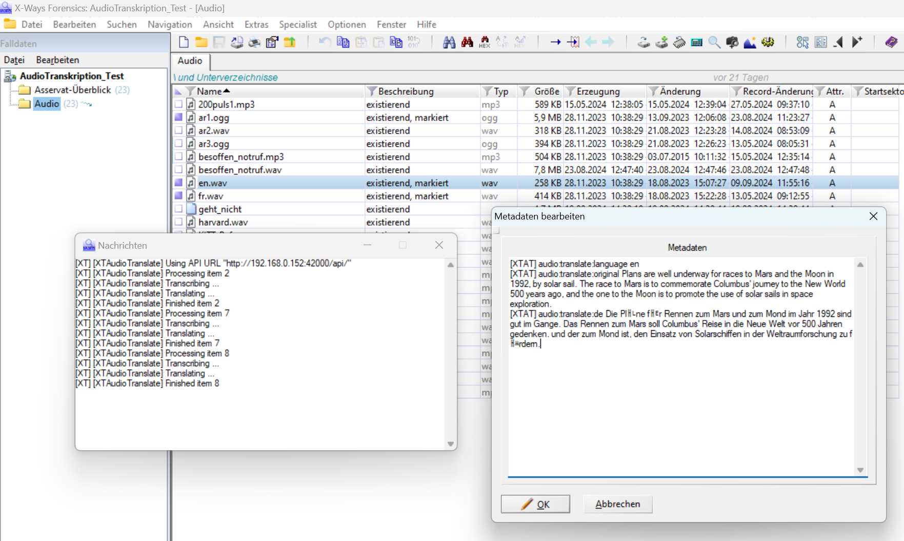

## Bekannte Worker

|Aufgabenart|Worker|
|---|---|
|`analyzetext`|[taskworker-analyzetext](https://github.com/hilderonny/taskworker-analyzetext)|
|`classifyimage`|[taskworker-classifyimage](https://github.com/hilderonny/taskworker-classifyimage)|
|`scanforvirus`|[taskworker-scanforvirus](https://github.com/hilderonny/taskworker-scanforvirus)|
|`transcribe`|[taskworker-transcribe](https://github.com/hilderonny/taskworker-transcribe)|
|`translate`|[taskworker-translate](https://github.com/hilderonny/taskworker-translate)|

## Bekannte Clients

|Client|Aufgabenarten|
|---|---|
|[IPED audio translate task](https://github.com/hilderonny/iped-audiotranslatetask)|`transcribe`, `translate`|
|[IPED image classification task](https://github.com/hilderonny/iped-imageclassificationtask)|`classifyimage`|
|[IPED virus scan task](https://github.com/hilderonny/iped-virusscantask)|`scanforvirus`|
|[NUIX audio translate plugin](https://github.com/hilderonny/nuix-audiotranslateplugin)|`transcribe`, `translate`|
|[X-Ways audio translate X-Tension](https://github.com/hilderonny/xways-audiotranslate)|`transcribe`, `translate`|

## API

- Stamm-URL für alle APIs ist `/api/`, zum Beispiel `http://127.0.0.1:42000/api/`.
- [taskbridge.js](./html/taskbridge.js) enthält Hilfsfunktionen zur einfachen Verwendung der API.

### `GET /api/tasks/list/` - Alle Aufgaben auflisten

`getTaskList()`

#### Response

```json
[
    {
        "id": "36b8f84d-df4e-4d49-b662-bcde71a8764f",
        "type": "translate",
        "status": "inprogress",
        "progress": 50,
        "createdat": 1717394497292,
        "startedat": 1717395321826,
        "completedat": 1717395345196
    },
    ...
]
```

### `POST /api/tasks/add/` - Aufgabe hinzufügen

`addTask(type, data, file, requirements)`

Der Request muss als `MultiPartForm` gesendet werden und muss ein Feld `json` mit folgendem Inhalt enthalten.

#### Request

```json
{
    "type": "translate",
    "requirements": {
        "sourcelanguage": "en",
        "targetlanguage": "de"
    },
    "data": "Hello World"
}
```

Falls die Daten zu groß sind, können sie anstelle des `data` Attributes auch direkt im MultiPartForm als Eigenschaft `file` als Datei angehangen werden.

#### Response

```json
{
    "id": "36b8f84d-df4e-4d49-b662-bcde71a8764f"
}
```

### `POST /api/tasks/take/` - Aufgabe zur Verarbeitung abholen

#### Request

```json
{
    "type": "translate"
}
```

#### Response

```json
{
    "id": "36b8f84d-df4e-4d49-b662-bcde71a8764f",
    "data": "Hello World",
    "file": "file_id"
}
```

### `POST /api/tasks/progress/:id` - Aufgabenstatus mitteilen

#### Request

```json
{
    "progress": "50"
}
```

### `POST /api/tasks/complete/:id` - Fertigstellung mitteilen

#### Request

```json
{
    "result": "Hallo Welt"
}
```

### `DELETE /api/tasks/remove/:id` - Aufgabe löschen

Antwort ist stets HTTP-Status `200`.

### `GET /api/tasks/restart/:id` - Aufgabe neu starten

Aufgabe wird auf Status "Offen" gesetzt und kann erneut bearbeitet werden.

### `GET /api/tasks/status/:id` - Statusinformationen über Aufgabe erhalten

#### Response

```json
{
    "status": "inprogress",
    "progress": 50
}
```

### `GET /api/tasks/result/:id` - Ergebnisse einer Aufgabe abrufen

#### Response

```json
{
    "result": "Hallo Welt"
}
```

### `GET /api/tasks/details/:id` - Vollständige details einer Aufgabe erhalten

#### Response

```json
{
    "id": "36b8f84d-df4e-4d49-b662-bcde71a8764f",
    "type": "translate",
    "file": "nqzv74n3vq7tnz45378qoztn47583qnbzt45",
    "worker": "ROG",
    "status": "inprogress",
    "progress": 50,
    "createdat": 1717394497292,
    "startedat": 1717395321826,
    "completedat": 1717395345196,
    "requirements": { ... },
    "data": { ... },
    "result": { ... }
}
```

### `GET /api/tasks/file/:id` - Zu einer Aufgabe gehörende Datei herunterladen

Das Ergebnis ist ein Binär-Stream der Datei.

### `GET /api/tasks/statistics/` - Statistiken zu Aufgabentypen erhalten

#### Response

```json
{
    "transcribe": 1234,
    "translate": 2345,
    ...
}
```

### `GET /api/workers/list/` - Aktive Worker auflisten

#### Response

```json
[
    {
        "name": "RH-WORKBOOK",
        "type": "translate",
        "status": "idle",
        "taskid": "36b8f84d-df4e-4d49-b662-bcde71a8764f",
        "lastping": 292
    },
    ...
]
```

### `GET /api/tasks/workerstatistics/` - Statistiken zu Workern erhalten

#### Response

```json
{
	"Worker-1": {
		"transcribe": 12345,
		"translate": 2345
	},
	"Worker-2": {
		"transcribe": 345,
		"translate": 34
	}
}
```

## Allgemeiner Aufbau einer Aufgabe

```js
task = {
    id: "36b8f84d-df4e-4d49-b662-bcde71a8764f",
    type: "translate",
    file: "nqzv74n3vq7tnz45378qoztn47583qnbzt45",
    worker: "ROG",
    status: "open",
    progress: 50,
    createdat: 1717394497292,
    startedat: 1717395321826,
    completedat: 1717395345196,
    data: { ... },
    result: { ... }
}
```

|Attribut|Beschreibung|
|---|---|
|`id`|Eindeutige ID der Aufgabe|
|`type`|Aufgabenart. Wird von Clients und Workern definiert. Beispiele für Standardaufgaben: `translate`, `transcribe`, `classifyimage`, `scanforvirus`|
|`file`|Name der Datei, falls die Aufgabe eine Datei angehangen hat|
|`worker`|Name des Worker, der gerade die Aufgabe bearbeitet oder bearbeitet hat|
|`status`|Status der Aufgabe. Kann `offen`, `inbearbeitung` oder `abgeschlossen`|
|`progress`|Bearbeitungsstatus als Zahl zwischen `0` und `100`|
|`createdat`|Zeitpunkt der Erstellung der Aufgabe in Millisekunden seit 01.01.1970 00:00|
|`startedat`|Zeitpunkt, zu dem die Aufgabe von einem Worker zur Bearbeitung abgeholt wurde in Millisekunden seit 01.01.1970 00:00|
|`completedat`|Zeitpunkt, zu dem die Aufgabe von einem Worker als "Abgeschlossen" markiert wurde in Millisekunden seit 01.01.1970 00:00|
|`data`|Daten der Aufgabe, die Worker anzuarbeiten haben|
|`result`|Ergebnis der Abarbeitung|

## Standardaufgabenarten

### `transcribe` - Mediendatei transkribieren

#### Request zur Erstellung

Die zu transkribierende Datei muss als `multipart/form-data` gesendet werden.

```
------WebKitFormBoundaryEbHBu6sLT8O0bwlK
Content-Disposition: form-data; name="file"; filename="en.wav"


------WebKitFormBoundaryEbHBu6sLT8O0bwlK
Content-Disposition: form-data; name="json"

{"type":"transcribe"}
------WebKitFormBoundaryEbHBu6sLT8O0bwlK--
```

#### Ergebnis

```json
{
  "result" : {
    "language" : "en",
    "texts" : [
      {
        "start" : 0.0,
        "end" : 1.0,
        "text" : "Line 1"
      },
      {
        "start" : 1.0,
        "end" : 2.0,
        "text" : "Line 2"
      }
    ],
    "device" : "cuda",
    "duration" : 12,
    "repository" : "https://github.com/hilderonny/taskworker-transcribe",
    "version" : "1.1.0",
    "library" : "fasterwhisper-0.8.15",
    "model" : "large-v2"
  }
}
```

|Attribut|Beschreibung|
|---|---|
|`language`|Anhand der ersten 10 Sekunden erkannte Sprache|
|`texts`|Liste von Texten. Üblicherweise in Sätze aufgeteilt|
|`texts.start`|Sekunde, zu der der Text in der Mediendatei beginnt|
|`texts.end`|Senkunde, an welcher der Text endet|
|`texts.text`|Text|
|`device`|`cuda`, wenn die Transkription auf einer Grafikkarte erfolgte, andernfalls `cpu`|
|`duration`|Benötigte Dauer der gesamten Transkription|
|`repository`|Herkunft des Workers|
|`version`|Version des Workers|
|`library`|Bibliothek, mit welcher die Transkription erfolgte|
|`model`|KI-Modell, welches für die Transkription verwendet wurde|

### `translate` - Text übersetzen

#### Request zur Erstellung

```
------WebKitFormBoundaryd3cBH0ciOvHMpqq1
Content-Disposition: form-data; name="json"


{"type":"translate","data":{"targetlanguage":"de","texts":["Hello world!","","Wer bist Du?"]}}
------WebKitFormBoundaryd3cBH0ciOvHMpqq1--
```

Der `json` Teil beinhaltet die zu übersetzenden Texte, `file` wird nicht verwendet.

```json
{
  "type": "translate",
  "data": {
    "sourcelanguage": "en",
    "targetlanguage": "de",
    "texts": [
      "Text of first line in english",
      "Текст второй строки на русском языке",
      "النص الثالث باللغة العربية"
    ]
  }
}
```

|Attribut|Beschreibung|
|---|---|
|`type`|Immer `transcribe`|
|`data.sourcelanguage`|Optionale Quellsprache für alle Texte. Wenn diese Angabe fehlt, wird versucht, die Sprache anhand des Textes für jeden text separat zu ermitteln|
|`data.targetlanguage`|Zielsprache|
|`data.texts`|Liste von Texten. Die Texte sollten in sich geschlossene Kontexte und nicht zu groß sein, z.B. Sätze oder Absätze.|

#### Ergebnis

```json
{
  "result" : {
    "texts" : [
      {
        "sourcelanguage" : "en",
        "text" : "Text der ersten Zeile auf Englisch"
      },
      {
        "sourcelanguage" : "ru",
        "text" : "Text der zweiten Zeile auf Russisch"
      },
      {
        "sourcelanguage" : "ar",
        "text" : "Text der dritten Zeile auf Arabisch"
      }
    ],
    "device" : "cuda",
    "duration" : 1.6,
    "repository" : "https://github.com/hilderonny/taskworker-translate",
    "version" : "1.3.0",
    "library": "transformers-4.44.2",
    "model": "facebook/m2m100_1.2B"
  }
}
```

|Attribut|Beschreibung|
|---|---|
|`texts`|Liste aller übersetzten Texte|
|`texts.sourcelanguage`|Im Text erkannte Quellsprache, falls nicht vorgegeben|
|`texts.text`|Übersetzter Text|
|`device`|`cuda`, wenn die Übersetzung auf einer Grafikkarte erfolgte, andernfalls `cpu`|
|`duration`|Benötigte Dauer der gesamten Übersetzung|
|`repository`|Herkunft des Workers|
|`version`|Version des Workers|
|`library`|Bibliothek, mit welcher die Übersetzung erfolgte|
|`model`|KI-Modell, welches für die Übersetzung verwendet wurde|

### `classifyimage` - Bild klassifizieren

Die Klassifizierung erfolgt nach [ILSVRC2011](https://image-net.org/challenges/LSVRC/2012/browse-synsets).

#### Request zur Erstellung

```
------WebKitFormBoundaryBa8ASYFEK2ewHAcI
Content-Disposition: form-data; name="file"; filename="Angry cat.jpeg"


------WebKitFormBoundaryBa8ASYFEK2ewHAcI
Content-Disposition: form-data; name="json"

{"type":"classifyimage","data":{"targetlanguage":"de","numberofpredictions":"10"}}
------WebKitFormBoundaryBa8ASYFEK2ewHAcI--
```

Der `file` Block muss das zu klassifizierende Bild enthalten

Der `json` Block muss folgende Angaben enthalten

```json
{
  "type": "classifyimage",
  "data": {
    "numberofpredictions": 10,
    "targetlanguage": "de"
  }
}
```

|Attribut|Beschreibung|
|---|---|
|`type`|Immer `classifyimage`|
|`data.numberofpredictions`|Anzahl der Vermutungen|
|`data.targetlanguage`|Zielsprache der Klassifizierungen. Kann `en` oder `de` sein|

#### Ergebnis

```json
{
  "result" : {
    "predictions": [
      {
        "class": "n02123394",
        "name": "Perserkatze",
        "probability": 0.8419579267501831
      },
      {
        "class": "n02328150",
        "name": "Angorakatze",
        "probability": 0.025817258283495903
      },
      {
        "class": "n02124075",
        "name": "Aegyptische Katze",
        "probability": 0.0048589943908154964
      }
    ],
    "duration" : 1.6,
    "repository" : "https://github.com/hilderonny/taskworker-imageclassifier",
    "version": "1.0.0",
    "library": "tensorflow-2.17.0",
    "model": "MobileNetV3Large"
  }
}
```

|Attribut|Beschreibung|
|---|---|
|`predictions`|Liste von Klassifizierungen, nach Wahrscheinlichkeit sortiert|
|`predictions.class`|Klasse nach [ILSVRC2011](https://image-net.org/challenges/LSVRC/2012/browse-synsets)|
|`predictions.name`|Name der Klasse in vorgegebener Sprache|
|`predictions.probability`|Wahrscheinlichkeit zwischen 0.0 (0%) und 1.0 (100%)|
|`duration`|Benötigte Dauer der gesamten Klassifizierung|
|`repository`|Herkunft des Workers|
|`version`|Version des Workers|
|`library`|Bibliothek, mit welcher die Klassifizierung erfolgte|
|`model`|KI-Modell, welches für die Klassifizierung verwendet wurde|

### `scanforvirus` - Datei nach Viren untersuchen

#### Request zur Erstellung

```
------WebKitFormBoundaryJA4SMm9qU1EOlbHO
Content-Disposition: form-data; name="file"; filename="mimikatz.exe"


------WebKitFormBoundaryJA4SMm9qU1EOlbHO
Content-Disposition: form-data; name="json"

{"type":"scanforvirus"}
------WebKitFormBoundaryJA4SMm9qU1EOlbHO--
```

Im `file` Block muss die zu scannende Datei enthalten sein.

#### Ergebnis

```json
{
  "result" : {
    "status": "FOUND",
    "detection": "Win.Dropper.Mimikatz-9778171-1",
    "duration": 0.018547,
    "repository": "https://github.com/hilderonny/taskworker-scanforvirus",
    "version": "1.0.0",
    "library": "clamd-1.0.2"
  }
}
```

|Attribut|Beschreibung|
|---|---|
|`status`|Scanergebnis. `OK`, wenn nichts gefunden wurde, `FOUND`, wenn ein Virus entdeckt wurde|
|`detection`|Wenn ein Virus gefunden wurde, wird hierin der Name des Virus gemeldet|
|`duration`|Benötigte Dauer des gesamten Scanvorgangs|
|`repository`|Herkunft des Workers|
|`version`|Version des Workers|
|`library`|Bibliothek, mit welcher der Scan erfolgte|

### `analyzetext`- Text durch Sprachmodell verarbeiten (ChatBot)

#### Request zur Erstellung

```
------WebKitFormBoundaryd3cBH0ciOvHMpqq1
Content-Disposition: form-data; name="json"


{"type":"analyzetext","data":{"messages": [{"role": "user","content": "why is the sky blue?"},{"role": "assistant","content": "due to rayleigh scattering."},{"role": "user","content": "how is that different than mie scattering?"}]}}
------WebKitFormBoundaryd3cBH0ciOvHMpqq1--
```

Der `json` Teil enthält die gesamte Chat-Historie und endet üblicherweise mit einer Benutzerfrage.

```json
{
  "type": "analyzetext",
  "data": {
    "messages": [
      {
        "role": "user",
        "content": "why is the sky blue?"
      },
      {
        "role": "assistant",
        "content": "due to rayleigh scattering."
      },
      {
        "role": "user",
        "content": "how is that different than mie scattering?"
      }
    ]
  }
}
```

|Attribut|Beschreibung|
|---|---|
|`type`|Immer `analyzetext`|
|`data.messages`|Liste von Chatnachrichten|
|`data.messages.role`|Rolle des CHatteilnehmers. `user` ist der Fragensteller (Benutzer), `assistant` ist das LLM, welches die Fragen beantwortet|
|`data.messages.content`|Inhalt der Nachricht|

#### Ergebnis

```json
{
  "result" : {
    "messages": [
      {
        "role": "user",
        "content": "why is the sky blue?"
      },
      {
        "role": "assistant",
        "content": "due to rayleigh scattering."
      },
      {
        "role": "user",
        "content": "how is that different than mie scattering?"
      },
      {
        "role": "assistant",
        "content": "mie scattering occurs when light interacts with larger particles in the air."
      }
    ],
    "duration" : 1.6,
    "repository" : "https://github.com/hilderonny/taskworker-analyzetext",
    "version" : "1.0.0",
    "library": "Ollama 0.4",
    "model": "llama3.2"
  }
}
```

|Attribut|Beschreibung|
|---|---|
|`messages`|Liste von Chatnachrichten|
|`messages.role`|Rolle des CHatteilnehmers. `user` ist der Fragensteller (Benutzer), `assistant` ist das LLM, welches die Fragen beantwortet|
|`messages.content`|Inhalt der Nachricht|
|`duration`|Benötigte Dauer der gesamten Verarbeitung|
|`repository`|Herkunft des Workers|
|`version`|Version des Workers|
|`library`|Bibliothek, mit welcher die Analyse erfolgte|
|`model`|KI-Modell, welches für den Chat verwendet wurde|

## Repository lokal zur Entwicklung einrichten

- Visual Studio Code einrichten
- Repository mit GIT klonen
- GO installieren

```
go init
```

Zum lokalen Testen existieren für Visual Studio Code die Startprofile **Mit Persistenz** (speichert die Aufgaben über Neustarts hinweg auf Festplatte) und **In Memory** (Aufgaben werden nur im Speicher gehalten, kein Festplattenzugriff).

### Erstellung des Docker Images

```sh
docker login
docker build -t hilderonny2024/taskbridge:2.1.0 .
docker push hilderonny2024/taskbridge:2.1.0
```
