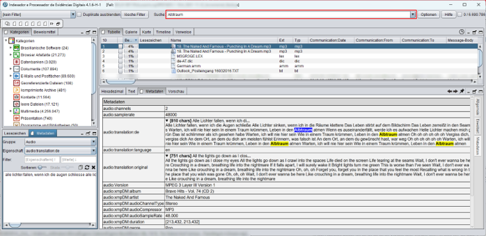

# TaskBridge

**TaskBridge** is a NodeJS application for distributed computing. There is one server as central communication endpoint which handles the distribution of tasks. **Clients** can set tasks for processing which the server stores in a holding pattern until the get fetched and processed by **workers**.

After a worker processed a task, it reports the results back to the **TaskBridge** and the original client can fetch the results afterwards.

The data of the tasks are only stored as long as they are in progress. After completion they get deleted from the server and from the processing worker.

The installation can be done in a secured environment without internet connection, can be scaled without (known) limits and has no hidden costs.

Below you can find documentation about the installation and usage of the **TaskBridge**.

- [Installation and running](doc/INSTALLATION.md)
- [API](doc/API.md)
- [Tasks](doc/TASKS.md)
- [Development](doc/DEVELOPMENT.md)

For a graphical user interface there is a [Web UI extension](https://github.com/hilderonny/taskbridge-webui) which you can install into the **TaskBridge**. It provides an overview of the status of the system and its currently running tasks.

In the Web UI you can also interact with the system and set tasks for a fast processing. For example you can upload a media file and let it be transcribed so that you will get the text within the fil in the original language.

In another section of the Web UI you can input text of anly language and let the workers translate it into another language of your choice.

If you have an image and want it to be classified by a single word, you can upload it in the Web UI and you will get a list of possible classes representing the image. The classes are based on the [Synsets retained from ILSVRC2011](https://image-net.org/challenges/LSVRC/2012/browse-synsets)

If you have a suspicious file and want to know whether it is save to open it, you can upload the file in the Web UI and a worker will sacn it for malware and virusses. As result you get a "No virus found" message or the name of the detected malware is shown to you. [ClamAV](https://www.clamav.net/) is working behind the scenes here.

When you need to analyzes or rephrase a text you can chat with it like with ChatGPT.

In the **Workers** tab you get an overview of all workers currently connected to the **TaskBridge** including their current status and abilities.

Currently there are several **Clients** implementations working with the **TaskBridge**. There is a Python Task for [IPED](https://github.com/sepinf-inc/IPED) ...

... a Ruby plugin for [NUIX](https://www.nuix.com/) ...

... and an X-Tension for [X-Ways](https://www.x-ways.net/).

## Known workers

|Task type|Worker|Description|
|---|---|---|
|`analyzetext`|[Text analysis](https://github.com/hilderonny/taskworker-analyzetext)|Reference implementation in Python for Windows and Linux|
|`classifyimage`|[Image classification](https://github.com/hilderonny/taskworker-classifyimage)|Reference implementation in Python for Windows and Linux|
|`scanforvirus`|[Virus scanning](https://github.com/hilderonny/taskworker-scanforvirus)|Reference implementation in Python for Windows and Linux|
|`transcribe`|[Audio transcription](https://github.com/hilderonny/taskworker-transcribe)|Reference implementation in Python for Windows and Linux|
|`translate`|[Text translation](https://github.com/hilderonny/taskworker-translate)|Reference implementation in Python for Windows and Linux|

## Known clients

|Client|Task types|
|---|---|
|[Taskbridge Web UI](https://github.com/hilderonny/taskbridge-webui)|`analyzetext`, `classifyimage`, `scanforvirus`, `transcribe`, `translate`|
|[IPED audio translate task](https://github.com/hilderonny/iped-audiotranslatetask)|`transcribe`, `translate`|
|[IPED image classification task](https://github.com/hilderonny/iped-imageclassificationtask)|`classifyimage`|
|[IPED virus scan task](https://github.com/hilderonny/iped-virusscantask)|`scanforvirus`|
|[NUIX audio translate plugin](https://github.com/hilderonny/nuix-audiotranslateplugin)|`transcribe`, `translate`|
|[X-Ways audio translate X-Tension](https://github.com/hilderonny/xways-audiotranslate)|`transcribe`, `translate`|
